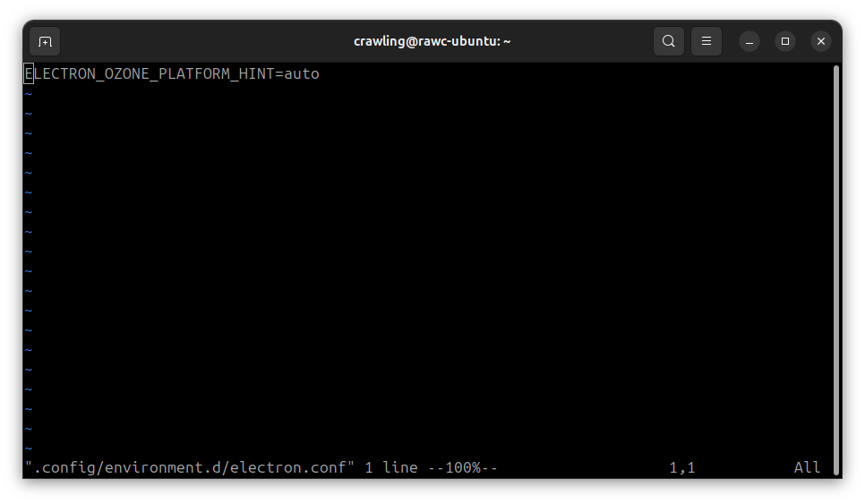

# Ozone Platform Hint

From Chris:

- The screenshot shows the path for the user-specific systemd environment settings. You'll probably need to create the environment.d directory like I did.
- The config file has to have a .conf extension otherwise it won't be processed.
- This environment variable (ELECTRON_OZONE_PLATFORM_HINT) is Electron specific so it won't apply to each browser that you want to run with the flag; you'll still need to override their settings individually. You know this, but you can obviously set the value to either 'auto' or 'wayland'.
- The user specific configuration files for systemd are not sourced as shell scripts so you can't use normal shell stuff in the config file.
- Logging out of Gnome and back in didn't make the change active (neither did restarting gdm), so I just rebooted after I put the file in place. I'm guessing you can reload the systemd settings or do something to avoid having to reboot.

Sent in tandem with [Overriding .desktop Files](./overriding-desktop-files).

Personal note: see `man environment.d`. This should work on all systemd user manager including GNOME.
